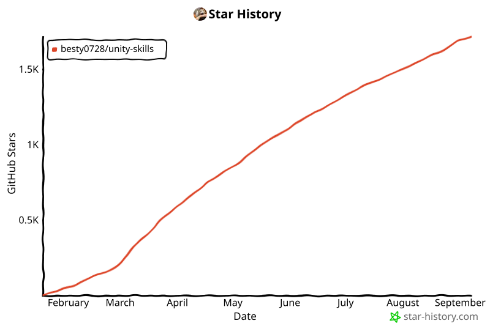

# 🎮 UnitySkills

<p align="center">
  
</p>

<p align="center">
  
  
  <a href="LICENSE"></a>
  <a href="README_CN.md"></a>
</p>

<p align="center">
  <b>REST API-based AI-driven Unity Editor Automation Engine</b><br>
  <i>Let AI control Unity scenes directly through Skills</i>
</p>

<p align="center">
  🎉 We are now indexed by <b>DeepWiki</b>!<br>
  Got questions? Check out the AI-generated docs → <a href="https://deepwiki.com/Besty0728/Unity-Skills"></a>
</p>

> The current official maintenance baseline is **Unity 2022.3+**. Some Unity 2021 compatibility logic may still remain in the codebase, but future feature work, regression testing, and adaptation will focus on **2022.3+ / Unity 6**.

## 📈 Project Contribution Rankings

<p align="center">
  <a href="https://trendshift.io/repositories/27085?utm_source=trendshift-badge&amp;utm_medium=badge&amp;utm_campaign=badge-trendshift-27085" target="_blank" rel="noopener noreferrer"></a>
  <a href="https://trendshift.io/repositories/27085?utm_source=trendshift-badge&amp;utm_medium=badge&amp;utm_campaign=badge-trendshift-27085" target="_blank" rel="noopener noreferrer"></a>
  <a href="https://trendshift.io/repositories/27085?utm_source=trendshift-badge&amp;utm_medium=badge&amp;utm_campaign=badge-trendshift-27085" target="_blank" rel="noopener noreferrer"></a>
</p>

## 🤝 Acknowledgments
This project is a deep refactoring and feature extension based on the excellent concept of [unity-mcp](https://github.com/CoplayDev/unity-mcp).

---

## 🚀 Core Features

- 🛠️ **805 REST Skills Toolkit**: 56 source files across 54 categories, plus 28 advisory design modules, with Batch operations.
- ⚡ **UnityCLI Support**: Bind UnityCLI to cold-start the bound project — no need to launch Unity Hub.
- 🔐 **Three-Tier Permission Modes**: Approval / Auto / Bypass with dual approval channels, aligned with Claude Code permission modes.
- 🤖 **6 Major IDEs Native Support**: Claude Code / Antigravity / Codex / Cursor / OpenCode / Kimi Code — one-click install and use.
- 🛡️ **Transactional Atomicity**: Failed operations auto-rollback, leaving scenes clean.
- 🌍 **Multi-Instance Control**: Automatic port discovery and global registry for controlling multiple Unity projects at once.
- 🔗 **Stable Long Connections**: Configurable request timeout (default 15 minutes), automatic recovery after Domain Reload.
- 🛡️ **Anti-Hallucination Guardrails**: Each Skill module includes DO NOT lists and routing rules.

---

## 🛡️ Built for Trust: The Governance Layer

An AI driving the Editor writes to real scenes, prefabs and `.meta` files. The interesting question isn't whether it *can* — it's what happens when it gets something wrong. UnitySkills answers that at four points in the call lifecycle:

- **Before execution**: `?mode=dryRun` / `?mode=plan` rehearsal — returns parameter validation and an impact estimate, writes nothing.
- **At execution**: the server derives high-risk gating (NeverInSemi) from each skill's risk metadata — gating never depends on the AI behaving well; **Allowlist** grants a persistent per-skill pass.
- **After execution**: every call, grant, revoke and blocked hit lands in a JSONL audit trail, browsable in the panel; deletions are audited too.
- **After a mistake**: five types of persistent snapshots survive Domain Reloads; `workflow_undo_task` rolls back one task, not the whole project; `POST /skills/batch` runs as a transaction (cross-step `$ref`, rollback on failure, `?diff=1` net change).

Full mechanics → [Operating Modes & Governance](docs/OPERATING_MODES.md)

### How this compares

| Dimension | UnitySkills | Typical MCP bridge | Unity's official AI Assistant |
| :--- | :--- | :--- | :--- |
| **Permission granularity** | Per-operation: three modes (Approval / Auto / Bypass) + risk metadata on every skill + per-skill Allowlist | No permission model — once connected, the whole tool surface is callable | Per-client trust (Pending Connections → Allow / Revoke); after approval, calls are not distinguished by operation |
| **Audit** | Structured JSONL for every call / grant / revoke / block, browsable in-panel; deletions are audited too | Process logs only; no structured per-call record | Surfaced as chat history and checkpoints rather than a per-operation audit record |
| **Rollback granularity** | Per-task, five snapshot types, file and `.meta` content-addressed, persists across sessions | Relies on Unity's native Undo stack; not guaranteed to survive a Domain Reload | Project-wide checkpoints taken per prompt — restoring rewinds the entire project to that point |
| **Pre-execution preview** | `?mode=dryRun` / `?mode=plan` — semantic parameter validation + impact estimate, nothing written | No equivalent found | No pre-execution parameter validation or impact preview found |
| **Batch transactions** | `POST /skills/batch` — fail-fast / `continueOnError`, cross-step `$ref`, rollback, `?diff=1` net change | Per-call tool invocations, no transaction semantics | Not exposed as a batch transaction |

> The **UnitySkills** column describes mechanisms that exist in this repository and can be checked against the source or by calling the endpoints. The other two columns reflect **public material and open-source repositories surveyed in 2026-07**; they characterise a class of tooling rather than any specific project, and those capabilities may have changed since.

---

## 🔐 Operating Modes

UnitySkills ships with a true server-side permission system aligned with Claude Code permission modes. All mode switching happens in the Unity panel: **Window > UnitySkills** → ⚙ Settings → **Server** section (chat trigger words are no longer supported).

| Mode | Default | Behavior |
|:-----|:-------:|:---------|
| **Approval** | — | Server returns a grant token; the AI executes after user approval |
| **Auto** | New installs | FullAuto skills run directly; high-risk ops (NeverInSemi) are auto-blocked |
| **Bypass** | Existing installs (upgrade) | All skills run unrestricted; only the optional high-risk confirmation gate remains |

Upgrading users are detected automatically and stay on **Bypass**, preserving the previous Full-Auto behavior with no action required. Dual approval channels (Dialog / Panel), the audit log (`Library/UnitySkillsAudit.jsonl`), Allowlist and installer details → [Operating Modes & Governance](docs/OPERATING_MODES.md).

> 28 advisory design modules (architecture, performance, design patterns, testability, package-specific source rules, etc.) are available in all modes and loaded on demand.

---

## 🏗️ Quick Install Supported IDE/Terminals

This project has been deeply optimized for the following environments (tools not listed are not necessarily unsupported — they just lack a quick installer; use ***Custom Installation*** instead. Per-tool skill directories are listed in the Manual Installation section below):

| AI Terminal | Support Status | Notes |
| :--- | :---: | :--- |
| **Antigravity** | ✅ Supported | Open Agent Skills standard; shares `.agents/skills/` with Codex in workspace mode |
| **Claude Code** | ✅ Supported | Intelligent Skill intent recognition, supports complex multi-step automation |
| **Codex** | ✅ Supported | Supports `$skill` explicit invocation and implicit intent recognition |
| **Cursor** | ✅ Supported | Auto-discovers skill directories; supports `/skill-name` explicit invocation |
| **Kimi Code** | ✅ Supported | Native skill directory discovery; supports `/skill:unity-skills` explicit invocation |
| **OpenCode** | ✅ Supported | Native workspace and global skill directory discovery |

---

## 🏁 Quick Start

> **Overview**: Install Unity Plugin → Start UnitySkills Server → AI Uses Skills

<p align="center">
  
</p>

### 1. Install Unity Plugin
Add via Unity Package Manager using Git URL:

**Stable Version (main)**:
```
https://github.com/Besty0728/Unity-Skills.git?path=/SkillsForUnity
```

**Beta Version (beta)**:
```
https://github.com/Besty0728/Unity-Skills.git?path=/SkillsForUnity#beta
```

**Specific Version** (e.g., v1.6.0):
```
https://github.com/Besty0728/Unity-Skills.git?path=/SkillsForUnity#v1.6.0
```

> 📦 All version packages are available on the [Releases](https://github.com/Besty0728/Unity-Skills/releases) page

### 2. Open the Panel & Start Server
In Unity, open menu: `Window > UnitySkills` (or press <kbd>Alt</kbd>+<kbd>Shift</kbd>+<kbd>U</kbd>). Use the server toggle switch in the top bar to start it; once started it auto-restarts across domain reloads.

> ⏳ `script_*`, `debug_force_recompile`, `debug_set_defines`, some asset reimports, and package changes may trigger compilation or Domain Reload. Temporary REST unavailability during that window is expected; wait a moment and retry.

### 3. One-Click AI Skills Configuration
1. Open `Window > UnitySkills` and go to the **AI Config** tab.
2. Select the corresponding terminal icon and click **"Install"** — the installer copies the `unity-skills~/` template from the package to the target location, no manual copying needed.

> 🔄 **Auto-sync on update**: after you upgrade the package, tools you already installed are refreshed to the new version automatically (nothing new is ever installed for you); turn it off in ⚙ Settings ▸ **AI Tools**.
>
> **Codex Note**: Antigravity and Codex share `.agents/skills/` in workspace mode — installing once makes the skill available to both; no `AGENTS.md` declaration needed for Codex.

📘 For complete installation and usage instructions, see: [Setup Guide](docs/SETUP_GUIDE.md) | [安装指南](docs/SETUP_GUIDE_CN.md)

<details>
<summary><b>4. Manual Skills Installation (Optional)</b></summary>

If one-click installation is not supported or preferred, follow this **standard procedure** for manual deployment (applicable to all tools supporting Skills):

#### ✅ Standard Installation Method A
1. **Custom Installation**: In the installation interface, select the "Custom Path" option to install Skills to any directory you specify (e.g., `Assets/MyTools/AI`) for easier project management.

#### ✅ Standard Installation Method B
1. **Locate Skills Source Directory**: The `SkillsForUnity/unity-skills~/` directory in the UPM package is the distributable Skills template (root directory contains `SKILL.md`).
2. **Find the Tool's Skills Root Directory**: Different tools have different paths; refer to the tool's documentation first.
3. **Copy Completely**: Copy the entire contents of `unity-skills~/` to the tool's Skills root directory (rename to `unity-skills/`).
4. **Create agent_config.json**: Create an `agent_config.json` file in the `unity-skills/scripts/` directory:
   ```json
   {"agentId": "your-agent-name", "installedAt": "2026-02-11T00:00:00Z"}
   ```
   Replace `your-agent-name` with the name of your AI tool (e.g., `claude-code`, `antigravity`, `codex`, `cursor`).
5. **Directory Structure Requirements**: After copying, maintain the structure as follows (example):
   - `unity-skills/SKILL.md`
   - `unity-skills/skills/`
   - `unity-skills/references/`
   - `unity-skills/scripts/unity_skills.py`
   - `unity-skills/scripts/agent_config.json`
6. **Restart the Tool**: Let the tool reload the Skills list.
7. **Verify Loading**: Trigger the Skills list/command in the tool (or execute a simple skill call) to confirm availability.

#### 🔎 Common Tool Directory Reference
The following are verified default directories (if the tool has a custom path configured, use that instead):

- Claude Code: `~/.claude/skills/`
- Antigravity: `~/.gemini/antigravity/skills/` (global) or `.agents/skills/` (workspace)
- OpenAI Codex: `~/.agents/skills/` (global) or `.agents/skills/` (workspace, shared with Antigravity)
- Cursor: `~/.cursor/skills/` (global) or `.cursor/skills/` (workspace); also auto-discovers `.agents/skills/`
- OpenCode: `~/.config/opencode/skills/` (global) or `.opencode/skills/` (workspace)
- Kimi Code: `~/.kimi-code/skills/` (global, or `$KIMI_CODE_HOME/skills/`) or `.kimi-code/skills/` (project); also auto-discovers `.agents/skills/`

#### 🧩 Other Tools Supporting Skills
If you're using other tools that support Skills, install according to the Skills root directory specified in that tool's documentation. As long as the **standard installation specification** is met (root directory contains `SKILL.md` and maintains `skills/`, `references/`, and `scripts/` structure), it will be correctly recognized.

</details>

---

<details>
<summary><b>📦 Skills Category Overview (805)</b></summary>

| Category | Count | Core Functions |
| :--- | :---: | :--- |
| **YooAsset** | 40 | Hot-update bundle builds/Collector full CRUD/BuildReport asset and dependency analysis/PlayMode runtime validation/Reporter-Debugger-AssetArtScanner tools |
| **Behavior** | 10 | Unity Behavior graph assets/agents/blackboard variables (com.unity.behavior, reflection-based) |
| **HybridCLR** | 12 | HybridCLR hot-update settings/codegen/DLL compile & copy pipeline (com.code-philosophy.hybridclr, reflection-based) |
| **Workflow** | 40 | Persistent history/Tiered task snapshots/Content-addressed file store/Auto-clean/Session-level undo/Rollback/Clear history/Bookmarks/Batch query-preview-execute jobs |
| **Cinemachine** | 34 | 2.x/3.x dual version auto-install/MixingCamera/ClearShot/TargetGroup/Spline |
| **Netcode** | 39 | Netcode for GameObjects setup/prefabs/lifecycle/host-server-client workflows/NGO 2.5+ attachable & component-controller helpers |
| **UI** | 29 | Canvas/Button/Text/InputField/Dropdown/ScrollView/Layout/Alignment/Image and selectable utilities |
| **UI Toolkit** | 31 | UXML/USS file management/UIDocument/PanelSettings full property read-write/Template generation/Structure inspection/Batch create/Runtime data binding/UXML upgrade/World-space panels |
| **ShaderGraph** | 23 | Shader Graph create/inspect/blackboard edit/constrained node editing |
| **ProBuilder** | 22 | ProBuilder shape creation/face-edge operations/UV tools/pivot edits/batch creation/mesh combination |
| **XR** | 22 | XR rig setup/interactors/interactables/teleportation/continuous move/UI/haptics/interaction layers |
| **Material** | 21 | Batch material property modification/HDR/PBR/Emission/Keywords/Render queue |
| **PostProcess** | 10 | SRP post-processing effect management |
| **GameObject** | 19 | Create/Find/Transform sync/Batch operations/Hierarchy management/Rename/Duplicate |
| **Perception** | 18 | Scene summary/health checks/stack detection/context export/dependency analysis/hotspots/diff/tag-layer stats/performance hints |
| **Volume** | 9 | VolumeProfile/Volume/VolumeComponent creation and parameter editing |
| **Validation** | 16 | Project validation/Empty folder cleanup/Reference detection/Mesh collider/Shader errors |
| **URP** | 7 | URP asset/renderer/renderer feature inspection and edits |
| **Decal** | 7 | URP Decal Projector create/inspect/configure/delete workflows |
| **DOTween** | 21 | DOTweenAnimation editor-time setup and tuning |
| **PrimeTween** | 5 | PrimeTween Free inspection, factory discovery, and runtime tween/sequence script generation |
| **Editor** | 16 | Play mode runtime capture/Frame stepping/Live state inspect/Selection/Undo-Redo/Context retrieval/Change journal/Menu execution |
| **Physics** | 12 | Raycast/SphereCast/BoxCast/Physics materials/Layer collision matrix |
| **Script** | 12 | C# script create/Read/Replace/List/Info/Rename/Move/Analyze |
| **Timeline** | 12 | Track create/Delete/Clip management/Playback control/Binding/Duration |
| **Asset** | 12 | Asset import/Delete/Move/Copy/Search/Folders/Batch folder creation/Batch operations/Refresh |
| **AssetImport** | 11 | Texture/Model/Audio/Sprite import settings/Label management/Reimport |
| **Camera** | 12 | Scene View control/Game Camera create/Properties/Screenshot/Orthographic toggle/List |
| **Graphics** | 11 | GraphicsSettings/QualitySettings/SRP asset operations |
| **Package** | 11 | Package management/Install/Remove/Search/Versions/Dependencies/Cinemachine/Splines |
| **Prefab** | 11 | Create/Instantiate/Override apply & revert/Batch instantiate/Variants/Find instances/Asset property editing |
| **Shader** | 11 | Shader create/URP templates/Compile check/Keywords/Variant analysis/Global keywords |
| **Test** | 13 | Test run/Run by name/Categories/Template create/Summary statistics |
| **Animator** | 10 | Animation controller/Parameters/State machine/Transitions/Assign/Play |
| **Audio** | 10 | Audio import settings/AudioSource/AudioClip/AudioMixer/Batch |
| **Cleaner** | 10 | Unused assets/Duplicate files/Empty folders/Missing script fix/Dependency tree |
| **Component** | 14 | Add/Remove/Property config/Batch operations/Copy/Enable-Disable |
| **Console** | 10 | Log capture/Clear/Export/Statistics/Pause control/Collapse/Clear on play |
| **Debug** | 11 | Error logs/Compile check/Stack trace/Assemblies/Define symbols/Memory info/Editor health diagnose |
| **Event** | 11 | UnityEvent listener management/Batch add/Copy/State control/List |
| **Light** | 11 | Light create/Type config/Intensity-Color/Batch toggle/Probe groups/Reflection probes/Lightmaps |
| **Model** | 10 | Model import settings/Mesh info/Material mapping/Animation/Skeleton/Batch |
| **NavMesh** | 10 | Bake/Path calculation/Agent/Obstacle/Sampling/Area cost |
| **Optimization** | 10 | Texture compression/Mesh compression/Audio compression/Scene analysis/Static flags/LOD/Duplicate materials/Overdraw |
| **Profiler** | 10 | FPS/Memory/Texture/Mesh/Material/Audio/Rendering stats/Object count/AssetBundle |
| **Scene** | 10 | Multi-scene load/Unload/Activate/Screenshot/Context/Dependency analysis/Report export |
| **ScriptableObject** | 13 | Create/Read-Write/Serialized-property path write (nested/array/reference)/Batch set/Delete/Find/JSON import-export |
| **Smart** | 10 | Scene SQL query/Spatial query/Auto layout/Snap to ground/Grid snap/Randomize/Replace |
| **Terrain** | 10 | Terrain create/Heightmap/Perlin noise/Smooth/Flatten/Texture painting |
| **Texture** | 10 | Texture import settings/Platform settings/Sprite/Type/Size search/Batch |
| **Project** | 10 | Player builds/Render pipeline/Build settings/Package management/Layer/Tag/PlayerSettings/Quality |
| **Addressables** | 8 | Addressable asset groups/Profiles/Labels/Build paths/Build/Entry add-remove (com.unity.addressables, reflection-based) |
| **QFramework** | 20 | QFramework architecture-layer codegen/ViewController & UIKit panel codegen/UIKit settings/ResKit AssetBundle mark-build-clear/architecture scan/API doc query (no UPM package, reflection-based) |
| **Sample** | 8 | Basic examples: Create/Delete/Transform/Scene info |

> ⚠️ Most modules support `*_batch` batch operations. When operating on multiple objects, prioritize batch Skills for better performance.
>
> 🧠 `unity-skills/skills/` also includes **28 advisory design modules** for architecture, script design, performance, maintainability, Inspector guidance, and package-specific source rules.

</details>

---

## 📂 Project Structure

```bash
.
├── SkillsForUnity/                 # Unity Editor Plugin (UPM Package)
│   ├── package.json                # com.besty.unity-skills
│   ├── unity-skills~/              # Cross-platform AI Skill Template (tilde-hidden, bundled with package)
│   │   ├── SKILL.md                # Main Skill Definitions (AI-readable)
│   │   ├── scripts/
│   │   │   └── unity_skills.py     # Python Client Library
│   │   ├── skills/                 # 82 module docs (54 REST/module docs + 28 documentation-only docs)
│   │   └── references/             # Unity Development References
│   └── Editor/
│       ├── Locales/                # Decoupled JSON Localization Assets (en.json, zh-CN.json, ru.json)
│       ├── Skills/                 # Core Skill Logic (56 *Skills.cs files → 54 SkillCategory categories, 805 Skills)
│       │   ├── SkillsHttpServer.cs # HTTP Server Core (Producer-Consumer)
│       │   ├── SkillRouter.cs      # Request Routing & Reflection-based Skill Discovery
│       │   ├── WorkflowManager.cs  # Persistent Workflow (Task/Session/Snapshot)
│       │   ├── RegistryService.cs  # Global Registry (Multi-instance Discovery)
│       │   ├── GameObjectFinder.cs # Unified GO Finder (name/instanceId/path)
│       │   ├── BatchExecutor.cs    # Generic Batch Processing Framework
│       │   ├── Localization.cs     # Multi-Language Localization Engine
│       │   └── ...                 # 805 Skills source code
│       └── UI/                     # UI Toolkit Windows & Controllers
│           ├── UnitySkillsWindow.{cs,uxml,uss} # Main Dashboard Window
│           ├── UnityCliWindow.{cs,uxml,uss}    # Unity CLI Configuration Panel
│           ├── AuditLogWindow.{uxml,uss}       # Audit Log Viewer
│           ├── Controllers/                    # UI Tab & Widget Controllers
│           └── Tabs/                           # UXML Tab Layouts & Settings Drawer
├── docs/
│   └── SETUP_GUIDE.md              # Complete Setup & Usage Guide
├── CHANGELOG.md                    # Version Update Log
└── LICENSE                         # MIT License
```

---

## ⭐Star History

<a href="https://www.star-history.com/?repos=Besty0728%2FUnity-Skills&type=date&logscale=&legend=top-left">
 <picture>
   <source media="(prefers-color-scheme: dark)" srcset="docs/star-history-dark.svg" />
   <source media="(prefers-color-scheme: light)" srcset="docs/star-history-light.svg" />
   
 </picture>
</a>

---

## 📄 License
This project is licensed under the [MIT License](LICENSE).

**Bundled font (separate license):** the editor window bundles a subsetted CJK font
`SkillsForUnity/Editor/UI/Fonts/UnitySkillsCN-Regular.ttf`, derived from
[Maple Mono](https://github.com/subframe7536/maple-font) (CN variant), licensed under the
**SIL Open Font License 1.1** — not MIT. The full license and attribution travel with the
font in that folder (`OFL.txt`, `THIRD-PARTY-NOTICES.md`).
